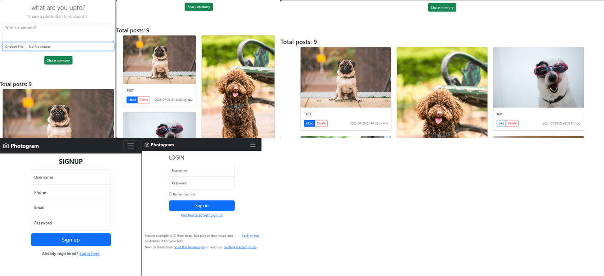

<b>PHOTOGRAM – SOCIAL MEDIA WEB APP</b>

 
Photogram is a modern photo-sharing social media platform where users can register, log in, upload photos with captions, like posts, and receive real-time notifications. Built using PHP, JavaScript, MySQL, and RabbitMQ, it is fully responsive and user-friendly.
  

<b>Project Preview</b>

<b>About the Project🎓</b>

    Photogram is a simple yet powerful social media web app designed for sharing photos.  
    Users can create an account, upload images with captions, like others' posts, and receive real-time notifications.The platform is built using PHP and MySQL with RabbitMQ for instant messaging and updates.It focuses on clean design, responsiveness, and a smooth user experience — ideal for learning full-stack development and real-time web concepts.

